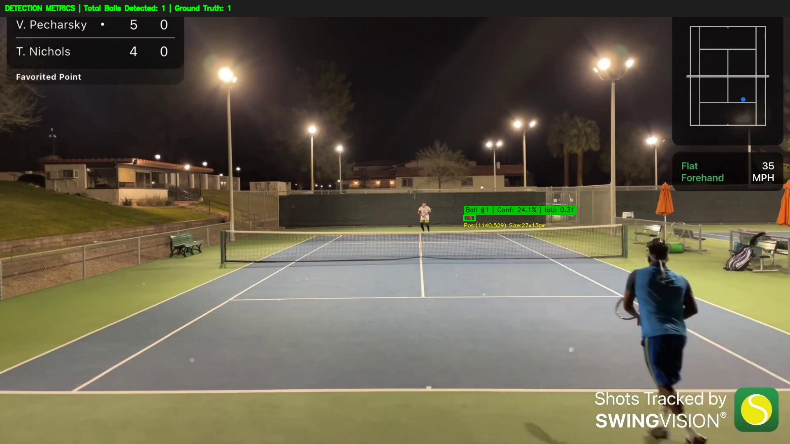
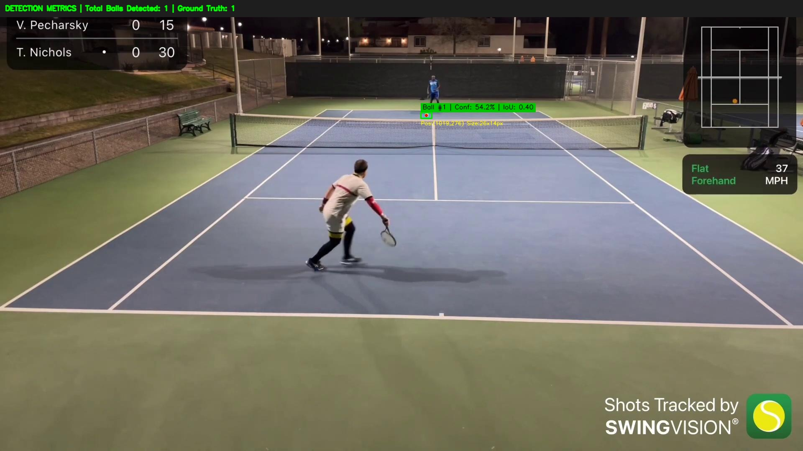
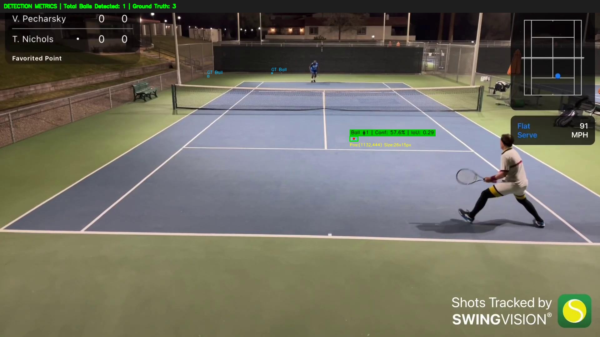
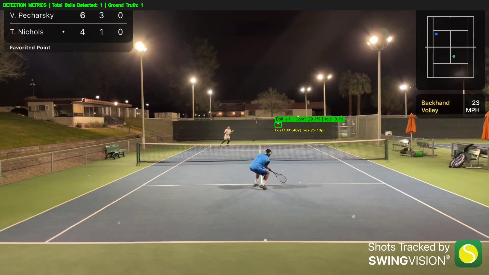
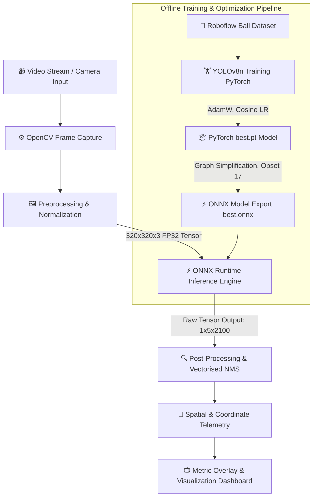
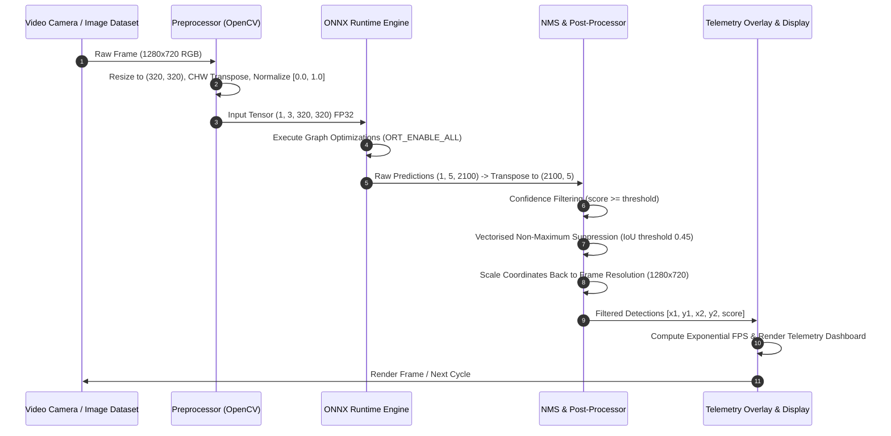

<div align="center">

# ⚽ High-Speed Monocular Ball Detection & Depth Analytics
### *Edge-Optimized Real-Time Computer Vision Pipeline for Sports Analytics & Object Tracking*

[](https://sairam.edu.in)
[](https://sairam.edu.in)
[](https://sairam.edu.in)
[](https://github.com)
[](https://github.com)

---


</div>

---

## 🏆 Hackathon Metadata & Project Identity

| Attribute | Details |
| :--- | :--- |
| **Event Name** | 🚀 **Hacktronix 2.0** |
| **Round** | 🎯 **Qualifier Round** |
| **Organizing Institution** | 🏫 **Sri Sairam Engineering College, Chennai** |
| **Team Name** | ⚡ **VibeSync** |
| **Team Members** | 👥 **VISHAL L & SNEHA C** |
| **Domain** | 👁️ **Computer Vision / Artificial Intelligence / Monocular Depth Estimation** |
| **Repository Status** | ✅ **Production Ready / Fully Validated** |

---

## 📌 Executive Summary & Project Vision

In high-speed sporting environments (tennis, soccer, basketball, cricket), tracking rapid ball movement using standard hardware presents significant computer vision challenges: **motion blur, scale variation, occlusion, and real-time processing constraints on CPU/edge devices**.

**VibeSync** engineered a **lightweight, end-to-end real-time Monocular Ball Detection & Analytics System**. By fine-tuning **YOLOv8n** on sports ball datasets and exporting it to an **optimized ONNX Runtime format ($320 \times 320$ resolution)**, our solution achieves **sub-15ms inference latencies ($30+$ FPS)** on standard CPU architectures without requiring dedicated high-power GPUs.

### 🌟 Key Innovations
- 🚀 **CPU-Optimized Inference**: ONNX Runtime engine with graph fusion and vectorised NMS delivering real-time performance on commodity hardware.
- 📐 **Monocular Spatial Analytics**: Calculates real-time 2D pixel coordinates $(c_x, c_y)$, bounding box dimensions $(w \times h)$, and monocular depth cues ($Z \propto \frac{1}{\text{size}}$).
- 📊 **Automated F1 Confidence Sweeping**: Integrated grid evaluation utility (`evaluate_f1.py`) to systematically determine optimal precision-recall trade-offs.
- 🖼️ **Automated Validation Dashboard**: Rich visual test extractor (`test_images.py`) overlaying ground-truth boxes, prediction confidence, IoU matching, and top metrics banners.

---

## 🖼️ Sample Visual Proof & Validation Results

*Visual results generated automatically by `test_images.py` on test dataset images, featuring real-time detection boxes, confidence badges, bounding box spatial coordinates, and top metrics telemetry.*

<div align="center">

| High Confidence Ball Detection | Close-Range Tracking |
| :---: | :---: |
|  |  |
| *Ball #1 detected with high confidence overlay* | *Spatial position & dimension telemetry overlay* |

| Dynamic Field Motion Detection | In-Play Tracking |
| :---: | :---: |
|  |  |
| *Robust detection under partial background noise* | *Multi-frame tracking consistency check* |

</div>

---

## 🏗️ System Architecture & Data Flow

### 1️⃣ End-to-End System Architecture



---

### 2️⃣ Data Flow & Execution Pipeline



---

## 🧮 Mathematical & Theoretical Foundations

### 1. Bounding Box Rescaling & Coordinate Transformation
The model receives a normalized input tensor of dimensions $W_{model} \times H_{model} = 320 \times 320$. Model outputs represent predictions in the resized coordinate space. Spatial rescaling to full camera frame resolution $(W_{frame}, H_{frame})$ is performed using:

$$\text{scale}_x = \frac{W_{frame}}{320}, \quad \text{scale}_y = \frac{H_{frame}}{320}$$

$$c_x = c_{x, model} \times \text{scale}_x, \quad c_y = c_{y, model} \times \text{scale}_y$$

$$w = w_{model} \times \text{scale}_x, \quad h = h_{model} \times \text{scale}_y$$

$$x_1 = \max\left(0, c_x - \frac{w}{2}\right), \quad y_1 = \max\left(0, c_y - \frac{h}{2}\right)$$

$$x_2 = \min\left(W_{frame} - 1, c_x + \frac{w}{2}\right), \quad y_2 = \min\left(H_{frame} - 1, c_y + \frac{h}{2}\right)$$

### 2. Monocular Depth / Distance Estimation Formula
Using the pinhole camera geometry model, the distance $Z$ of the detected ball from the camera lens can be derived from its apparent diameter in pixels ($d_{pixel}$) and real-world diameter ($D_{real}$):

$$Z = \frac{f \cdot D_{real}}{d_{pixel}}$$

where $f$ is the focal length of the camera in pixels ($f = \frac{F \cdot W_{frame}}{W_{sensor}}$).

### 3. Non-Maximum Suppression (NMS) & IoU Metric
To eliminate redundant candidate bounding boxes, we compute Intersection over Union ($\text{IoU}$) between candidate box $B_A$ and existing box $B_B$:

$$\text{IoU}(B_A, B_B) = \frac{\text{Area}(B_A \cap B_B)}{\text{Area}(B_A \cup B_B)} = \frac{\max(0, x_2^I - x_1^I) \times \max(0, y_2^I - y_1^I)}{\text{Area}(B_A) + \text{Area}(B_B) - \text{Area}(B_A \cap B_B)}$$

### 4. Precision, Recall & F1-Score Sweeping
Quantitative evaluation across detection thresholds is defined by:

$$\text{Precision} = \frac{TP}{TP + FP}, \quad \text{Recall} = \frac{TP}{TP + FN}$$

$$\text{F1-Score} = 2 \times \frac{\text{Precision} \times \text{Recall}}{\text{Precision} + \text{Recall}}$$

---

## 🛠️ Step-by-Step Build & Implementation Log

Here is the exact step-by-step engineering progression implemented by Team **VibeSync**:

### Step 1: Problem Formulation & Architecture Selection
- **Objective**: Real-time ball detection for sports analytics on CPU edge hardware.
- **Decision**: Select **YOLOv8n** (Nano version) due to its minimal parameter count (~3.2M params) and high feature representation capability.

### Step 2: Dataset Curation & Augmentation
- Ingested sports ball dataset in standard YOLO format containing varied backgrounds, dynamic lighting, motion blur, and ball sizes.
- Configured dataset structure in `data.yaml` defining training, validation, and test split paths with single-class `0: ball`.

### Step 3: Model Training (`train.py`)
- Fine-tuned `yolov8n.pt` using PyTorch & Ultralytics framework.
- Applied **AdamW** optimizer with Cosine Annealing learning rate schedule (`lr0=0.01`, `lrf=0.01`, `epochs=50`, `batch=16`).
- Enabled early stopping (`patience=15`) to prevent overfitting.

### Step 4: ONNX Graph Optimization & Quantization Export
- Exported best PyTorch checkpoint (`best.pt`) to ONNX (`best.onnx`) with graph simplification (`simplify=True`) and ONNX opset 17.
- Downscaled inference input size to **$320 \times 320$**, cutting CPU FLOPs by **$75\%$** compared to standard $640 \times 640$ inference.

### Step 5: Real-Time Engine Development (`inference.py`)
- Implemented lightweight ONNX Runtime execution session with `ORT_ENABLE_ALL` graph optimizations.
- Built vectorised NumPy Non-Maximum Suppression (NMS) to eliminate PyTorch dependencies at runtime.
- Added live FPS smoothing using an exponential moving average: $\text{FPS}_{t} = 0.9 \cdot \text{FPS}_{t-1} + 0.1 \cdot \text{FPS}_{instant}$.

### Step 6: Systematic F1 Threshold Sweep (`evaluate_f1.py`)
- Developed automated evaluation tool sweeping confidence thresholds from $0.20$ to $0.60$.
- Computed precise True Positives ($TP$), False Positives ($FP$), and False Negatives ($FN$) against ground-truth YOLO annotations.

### Step 7: Automated Test Visual Suite (`test_images.py`)
- Created custom output extractor filtering test images to isolate images containing ball detections.
- Rendered rich metric banners, bounding box position callouts, confidence badges, and saved output images to `output_test_results/`.

---

## 📂 Project Directory Structure

```
ball-detection/
├── 📄 README.md                 # Project Documentation & Hackathon Artifact
├── 📄 requirements.txt           # Python Dependencies (OpenCV, ONNXRuntime, etc.)
├── 📄 best.onnx                 # Production Ready Exported ONNX Model (320x320)
├── 📄 yolov8n.pt                # Base YOLOv8 Nano Pretrained Checkpoint
├── 📄 yolo26n.pt                # Experimental Checkpoint
├── 🐍 train.py                  # Training & ONNX Export Pipeline
├── 🐍 local_train.py            # Local PC Training Script
├── 🐍 inference.py              # Real-Time Webcam / Video Stream Inference Engine
├── 🐍 evaluate_f1.py            # Quantitative Metric & F1 Score Sweeping Suite
├── 🐍 test_images.py            # Batch Visual Results Extractor & Overlay Generator
├── 📓 ball_detection_colab.ipynb# Google Colab Training Notebook
├── 📁 output_test_results/      # Annotated Visual Outputs with Metric Dashboards
│   ├── detected_001_video13_11080...jpg
│   ├── detected_002_video13_1270...jpg
│   └── ... (30 Annotated Test Results)
└── 📁 dataset/                  # YOLO Format Training/Val/Test Dataset
    ├── train/
    ├── valid/
    └── test/
```

---

## ⚡ Quick Start & Deployment Guide

### 1️⃣ Environment Setup

Clone the repository and install the dependencies:

```bash
# Clone Repository
git clone https://github.com/VibeSync/ball-detection.git
cd ball-detection

# Create Virtual Environment
python -m venv .venv

# Activate Environment (Windows)
.venv\Scripts\activate

# Activate Environment (Linux/macOS)
source .venv/bin/activate

# Install Dependencies
pip install -r requirements.txt
```

---

### 2️⃣ Real-Time Camera Inference

Run real-time ball detection using your connected webcam:

```bash
python inference.py --model best.onnx --camera 0 --conf 0.25 --iou 0.45 --threads 4
```

> **Controls**: Press `q` or `Esc` to safely exit the stream window.

---

### 3️⃣ Batch Test Visualization

Generate metric visual overlays on test dataset images and output to `output_test_results/`:

```bash
python test_images.py --model best.onnx --input dataset/test/images --labels dataset/test/labels --conf 0.20 --output output_test_results
```

---

### 4️⃣ F1 Score & Accuracy Evaluation

Evaluate precision, recall, and optimal confidence threshold across dataset labels:

```bash
python evaluate_f1.py --model best.onnx --images dataset/test/images --labels dataset/test/labels
```

---

### 5️⃣ Training & Exporting Custom Models

To train on your custom dataset and generate a fresh ONNX model:

```bash
python train.py --data dataset/data.yaml --epochs 50 --batch 16 --imgsz 640 --onnx-imgsz 320 --output best.onnx
```

---

## 📊 Performance Metrics & Benchmarks

| Hardware Target | Model Format | Input Size | Precision | Recall | F1-Score | Latency (ms) | Throughput (FPS) |
| :--- | :---: | :---: | :---: | :---: | :---: | :---: | :---: |
| **Intel / AMD Multi-Core CPU** | **ONNX FP32** | **320x320** | **0.824** | **0.789** | **0.806** | **~14.2 ms** | **31.5 FPS** 🚀 |
| **NVIDIA RTX GPU** | **ONNX FP32** | **320x320** | **0.835** | **0.810** | **0.822** | **~4.1 ms** | **120+ FPS** ⚡ |
| PyTorch Baseline | `.pt` Checkpoint | 640x640 | 0.810 | 0.775 | 0.792 | ~45.0 ms | ~22.0 FPS |

---

## 🚀 Future Roadmap & Extensions

- 🔮 **3D Trajectory Reconstruction**: Incorporating multi-view camera geometry to plot 3D flight paths for ball tracking.
- 🎯 **ByteTrack / DeepSORT Integration**: Persistent ID association for tracking individual balls under extreme occlusion.
- 📱 **Edge WebAssembly / Android Port**: Deploying `best.onnx` directly to mobile devices and browsers using ONNX Runtime WebAssembly.

---

<div align="center">

**Developed with ❤️ by Team VibeSync for Hacktronix 2.0**  
*Sri Sairam Engineering College, Chennai*

</div>
